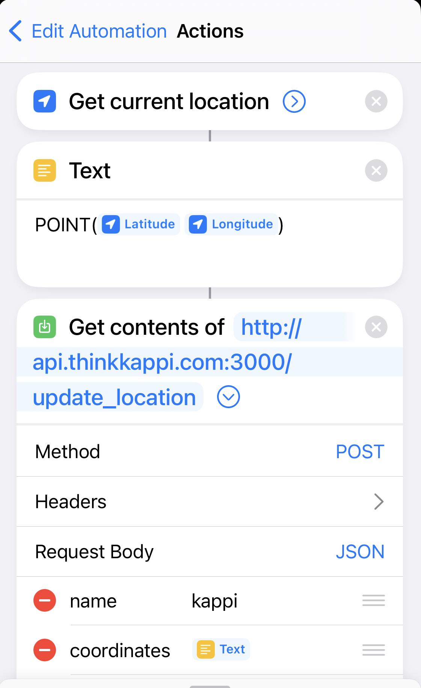

# WeasleyClock
This repo contains the code and documentation for a mechatronic ["Weasley Clock"](https://harrypotter.fandom.com/wiki/Weasley_Clock#:~:text=Located%20in%20the%20living%20room,%2C%20and%20%22mortal%20peril%22.) - a side project that displays the locations of people on an analog clock. This project was a collaboration between myself (software engineer) and my friend Matt Stephens (mechanical engineer).

## Documentation
### Introduction
The aim of this project was to make a physical clock with analog hands that could track the locations of 4 people and display their semantic locations - for example, "home", "work" or "school". The software side of this project was straightforward, with the exception of getting iPhones to send background location updates - an understandable security risk that Apple isn't keen to enable easily. The hardware was more challenging - the original Weasley Clock had 9 hands, but the design of this clock limited the number of hands because the depth of the clock increases a fair amount with eaach additional hand.

### Hardware Design
To get 4 hands all moving independently, we decided on a design of 4 nested tubes each driven by a separate stepper motor behind the clockface. Each smaller tube protudes out beyond the larger tube it is nested within, both on the back side of the clock (where the stepper motors drive the movement) and on the front side (where the hands are attached).

Each stepper motor drives a gear, which in turn drives a gear fixed to the back end of its tube - thereby turning the driveshaft for its hand. The motors are each mounted on a plywood board with a hole in the center for the tubes to pass through, and all four boards are stacked in a cuboid housing behind the clockface. The housing has additional space to hold the stepper motor drivers and the raspberry pi, and the entire motor housing can then sit inside the cylindrical clock, with just the concentric tubes protuding through the clock face. Each protuding tube is then attached via set-screw to a 3D printed component with a slit to hold a clock hand. All the hardware is modular and easy to disassemble and reassemble for updates.

### Software Design
In order to be able to easily move the clock and not have to worry about having users update the endpoint they used to report their locations when the clock changed IP address, we decided to use a design of a central cloud server which users could send location updates to, and the clock could fetch locations from. It was straightforward to do this by adding an "api" subdomain to my existing thinkkappi.com domain, and use my existing webhosting to create a very simple node.js server that offered two endpoints:
- `/update_location`
- `/get_locations`

These wrote to and read from a simple mysql table also hosted in my exisitng web hosting.

I then set up a cron job on the clock's raspberry pi to fetch the users recent coordinates once per minute and compute the semantic locations from them, and then compute and execute the steps each motor needed to move its hand to the correct location.

#### Reporting iPhone Locations
This is not easy. Making your own developer app (i.e. not registered on the app store, just loaded onto an iPhone directly from your xcode build) would be one way to approach this, and you'd have to request permission to access background location. However, background location access is infamously battery intensive and developer apps remove themselves from devices after 7 or 90 days depending on if you pay to be an official iPhone developer or not. 

Instead, we opted for a hacky workaround, which was to exploit the 'automation' feature in the native Shortcuts app on iPhone. Automations allow you to 'script' actions for your iPhone to take based on chosen triggers, and some of those triggers don't require you to manually confirm that the action should take place. There is a 'time of day' trigger, but you can't get anything more frequent than once daily from it, and there is a 'on email receipt' trigger, which would have been useful (set up a script to send an email with 'weasley_clock_location_update' as the subject every minute) but sadly it requires confirmation to run each time it is triggered. 

In the end, I opted for the "App" trigger, which doesn't require confirmation and will run each time an app is opened. I have users pick the app they use most frequently as their trigger, and then set the actions to make a POST request to the `/update_location` endpoint with a payload of the iPhone's current lat/lng (a value that shortcuts allows you to access). While this isn't perfect, it seems to work well enough as people tend to check their phones in transitional times of their day, when they are likely to be changing semantic location. Just make sure to select 'best' on the Current Location variable's granularity, otherwise you just get within 100m as default.

    
    
    

## Directory Structure
### [Embedded](https://github.com/Kappibw/WeasleyClock/tree/master/embedded)
Code running on the rasberry pi, physically inside the clock, governing the hardware.

### [Server](https://github.com/Kappibw/WeasleyClock/tree/master/server)
Code running in the cloud managing location updates.
